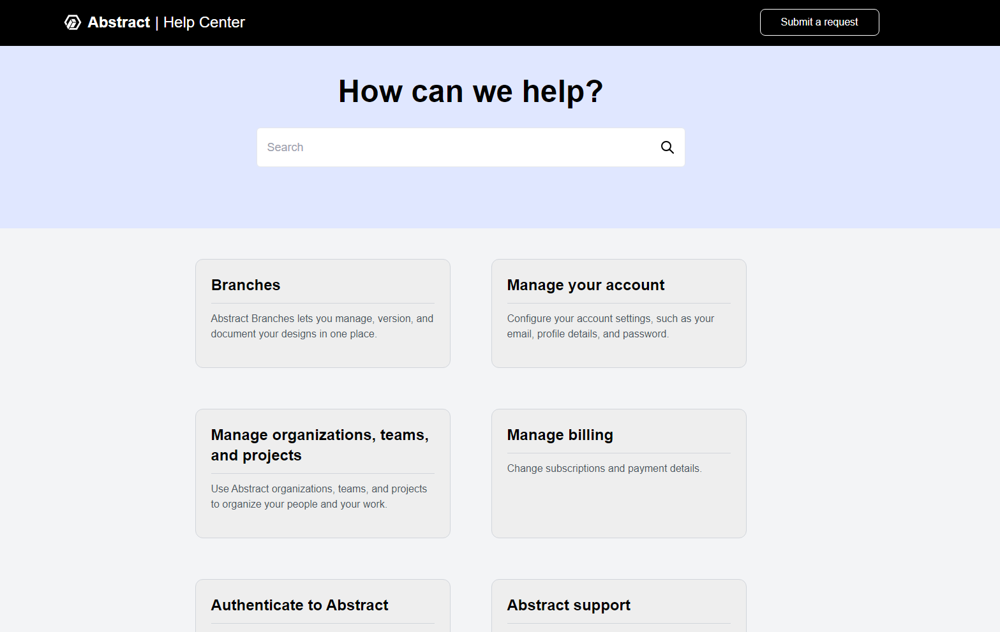

# Help Center Application

This project is a full-stack application featuring a Help Center with a React frontend and a Node.js backend.

<p align="center">
  
</p>

## Prerequisites

- Node.js (v14 or later)
- MongoDB (v4.4 or later)

## Setup

1. Clone the repository:
```git clone https://github.com/rohanvron/fullstack-assignment``` 
```cd fullstack-assignment```

2. Install dependencies:
```cd frontend && npm install cd ../backend && npm install```


3. Set up the local MongoDB server:
- Start your MongoDB server
- Create a database named `helpcenter`
- The collection `cards` will be automatically created when you run the seeder

4. Set up environment variables:
Create a `.env` file in the `backend` directory with the following content:
```MONGODB_URI=mongodb://localhost:27017/helpcenter```
```PORT=500```


5. Seed the database:
```cd backend node seeds/cardSeeder.js```


## Running the Application

1. Start the backend server:
```cd backend npm start```


2. In a new terminal, start the frontend development server:
```cd frontend npm run dev```


3. Open your browser and navigate to `http://localhost:5173` to view the application.

## API Endpoints

- GET /api/cards - Retrieve all cards
- POST /api/cards - Create a new card
- GET /api/cards/:title - Retrieve a specific card by title

## Technologies Used

- Frontend: React, Vite, Tailwind CSS
- Backend: Node.js, Express.js, MongoDB
- Database: MongoDB

